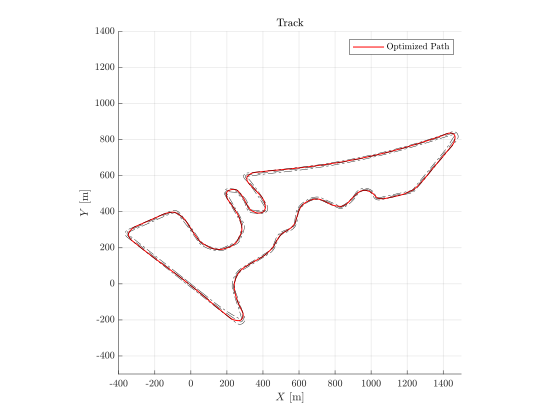
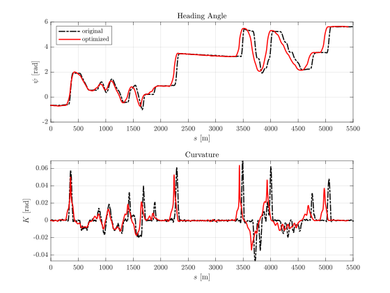
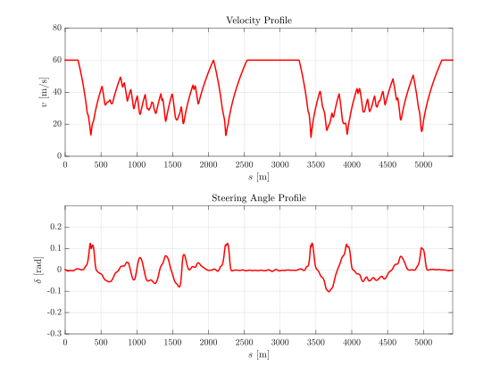

## A Sequential Two-Step Algorithm for Fast Generation of Vehicle Racing Trajectories

This project implements the sequential two-step algorithm proposed by [Nitin R. Kapania et al](https://arxiv.org/abs/1902.00606).  The optimized path is shown in the figure below:  



We verify the result using the CarMaker simulation environment by combining the optimized trajectory as feedforward commands and two feedback controllers for disturbance rejections.

## Requirements
- [MATLAB](https://www.mathworks.com/products/matlab.html)
- [CVX](http://cvxr.com/cvx/)

## Run
To generate the result, please run the script in MATLAB console:
```
$ SequentialTrajectoryGeneration
```

The result is store as a cell data structure with the name `Result`. Each row of `Result` represents the output from each iteration and each column stores the longitudinal velocities, steering angles, lap time, and path in order. All of the results are parameterized by the arc-length. The figures below show the optimized trajectory after three iterations.



